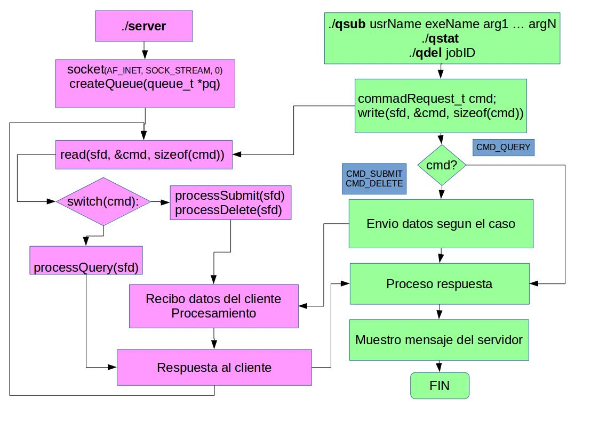

# Implementación

1. Se implementa un servidor que gestiona la ejecución de programas
   usando un servicio de colas.
2. Se usa el protocolo TCP.
3. Se implemente un protocolo de comunicación.


Servidor | Cliente
-------- | --------
cola de jobs | -
thread, fork | -
./server | -
 1. Recibe job de un usuario | ./qsub
 2. Reporta el estado de la cola | ./qstat
 3. Elimina job enviado | ./qdel

# Estructuras (1): Job unit y Cola

\begincols
\begincol{.6\textwidth}
```{c, eval=FALSE}
typedef struct {
	jobId_t			id;
	jobSubState_t	jss;
	exeFromUser_t	its;
	unsigned		n_args;
	char			**arg;
	time_t			submit;
	time_t			start;
} jobUnit_t;

typedef struct {
	char	user[USR_SIZE];
	char	exe[EXE_SIZE];
} exeFromUser_t;
```
\endcol
\begincol{.4\textwidth}
```{c, eval=FALSE}
typedef enum {
	JOB_QUEUED,
	JOB_RUNNING,
	JOB_KILLED,
} jobSubState_t;

typedef struct {
  unsigned 	h, t;
  jobUnit_t *pqueue;
  pthread_cond_t sp;
  pthread_cond_t el;
  pthread_mutex_t mtx;
} queue_t;

```
\endcol
\endcols

# Estructuras (2): client request and response

\begincols
\begincol{.5\textwidth}
```{c, eval=FALSE}
typedef enum {
	CMD_SUBMIT,
	CMD_QUERY,
	CMD_DELETE,
} commandRequest_t;

typedef struct {
  exeFromUser_t	its;
  unsigned n_args;
} submitRequest_t;

typedef unsigned
  deleteRequest_t;
```
\endcol
\begincol{.5\textwidth}
```{c, eval=FALSE}
typedef struct {
  submitResponse_t subRes;
  queryResponse_t qryRes;
  deleteResponse_t delRes;
} serverResponse_t;

typedef struct {
  jobId_t id;
  char msg[MSG_SIZE];
} submitResponse_t;

typedef submitResponse_t
  deleteResponse_t;
```
\endcol
\endcols

# Estructuras (3): Estado de la cola 

\begincols
\begincol{0.5\textwidth}
```{c, eval=FALSE}
typedef struct {
  jobState_t job;
  boolean_t islast;
} queryResponse_t;

typedef struct {
	jobId_t			id;
	jobSubState_t	jss;
	exeFromUser_t	its;
	regTime_t		reg;
	runningTime_t	run;
} jobState_t;
```
\endcol
\begincol{0.5\textwidth}
```{c, eval=FALSE}
typedef struct {
  /* se man(3) localtime */
  struct tm submit;
  struct tm start;
} regTime_t;

typedef struct{
  unsigned hours;
  unsigned minutes;
  unsigned seconds;
} runningTime_t;
```
\endcol
\endcols


# Ejecución de los programas
```{bash, eval = FALSE}
$ ./qsub userName exeName arg1 arg2 ... argn
job with id 1 has been submitted.
```
```{bash, eval = FALSE}
$ ./qstat
------------------------------------------------------
job user program submit time  start time  running time
------------------------------------------------------
001 pepe ls      [10:07:03]   [10:07:03]  [00:00:10]
002 pipo ls      [10:07:06]   [10:07:06]  [00:00:07]
003 pipa ls      [10:07:08]   [waiting ]  [00:00:00]
004 pipa ls      [10:07:09]   [waiting ]  [00:00:00]
005 pipa ls      [10:07:12]   [waiting ]  [00:00:00]
```
```{bash, eval = FALSE}
$ ./qdel 2
job with id 2 has been deleted.
```

# Diagrama de flujo




# main del server
```{c, eval=FALSE}
 int sockfd, i;
 unlink("socketfile");
 //sockfd = setupServerSocket_UNIX("socketfile");
 sockfd = setupServerSocket_INET();
 createQueue(&Q);
 /* Creo pool de threads para que ejecuten los progrmas */
 pthread_t thread[NUM_THREADS];
 for(i=0; i<NUM_THREADS; i++){
   wt[i].id = i;
   pthread_create(&thread[i], NULL, assignWork2thread,
   (char *) &wt[i]);
 }
 listen(sockfd,5);
 while(1){
	attendClient(sockfd);
 }
 return 0; 
```

# attendClient
```{c, eval=FALSE}
void attendClient(int fd){
	commandRequest_t cmd;
	int sockfd = accept(fd, NULL, NULL);

	read(sockfd, &cmd, sizeof(cmd));
	
	switch(cmd){
		case CMD_SUBMIT:
			processSubmit(sockfd);
			break;
		case CMD_QUERY:
			processQuery(sockfd);
			break;
		case CMD_DELETE:
			processDelete(sockfd);
	}
}
```
# processSubmit
```{c, eval=FALSE}
void processSubmit(int fd){
	submitRequest_t req;
	jobUnit_t job;
	int i;
	/* leo el submitRequest */
	read(fd, &req, sizeof(req));
	/* proceso el submit, lo transformo en un unitJob */
	job.id = ++COUNT;
	job.its = req.its;
	job.n_args = req.n_args;
	/* proceso los argumentos del ejecutable
	 * n_args contiene el nombre del ejecutable
	 * y agrego un puntero para NULL, requerido por execvp
	 */
	job.arg = (char **)malloc((job.n_args + 1) * 
			  sizeof(char *));
	size_t argSz;
```
---
```{c, eval=FALSE}
	for(i=0; i< job.n_args; i++){
		read(fd, &argSz, sizeof(argSz));
		job.arg[i] = (char *)malloc(argSz+1);
		read(fd, job.arg[i], argSz);
		job.arg[i][argSz] = 0;
	}
	/* ultimo puntero tiene que apuntat a NULL,
	 * ver man(3) execvp
	 */
	job.arg[job.n_args] = NULL;

	/* Ahora que tengo el UnitJob, lo mando a la cola */
	queuePut(&Q, &job);

	/* Ahora devuelvo un mensaje al cliente */
	submitResponse(job.id, fd);
}
```

# Gracias por su atención
