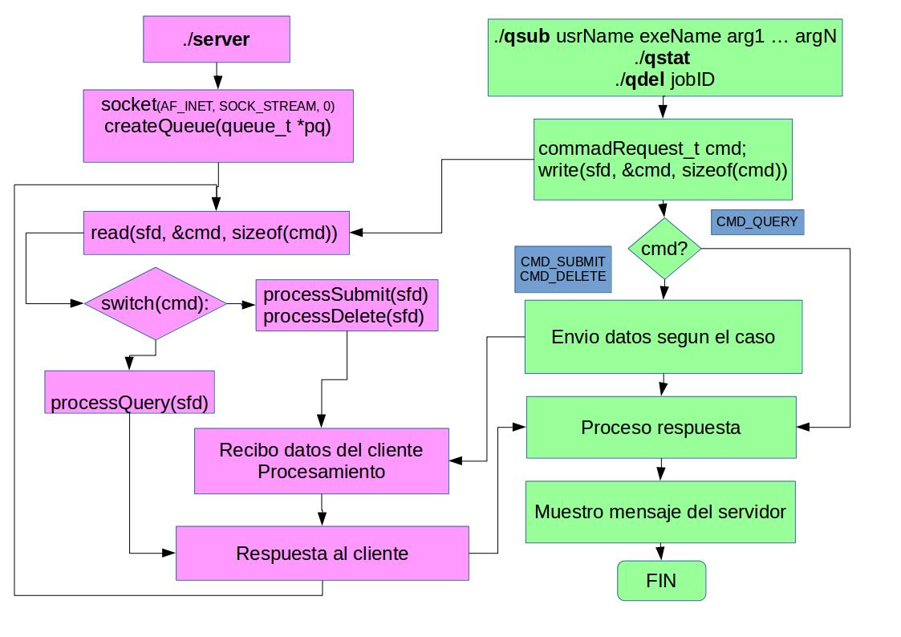

# Implementación

1. Se implementa un servidor que gestiona la ejecución de programas
   usando un servicio de colas.
2. Se usa el protocolo TCP.
3. Se implemente un protocolo de comunicación.


----------------------------------- --------
Servidor                            Cliente
----------------------------------- --------
cola de jobs                        -	
	
NUM_THREADS                         -

./server                            -

 1. Recibe job de un usuario        ./qsub

 2. Reporta el estador de la cola   ./qstat

 3. Elimina job enviado             ./qdel
----------------------------------- --------

# Estructuras (1) 

```{c, eval=FALSE}
typedef enum {
	CMD_SUBMIT,
	CMD_QUERY,
	CMD_DELETE,
} commandRequest_t;

typedef enum {
	JOB_QUEUED,
	JOB_RUNNING,
	JOB_KILLED,
} jobSubState_t;
```
```{c, eval=FALSE}
typedef struct {
	char	user[USR_SIZE];
	char	exe[EXE_SIZE];
} exeFromUser_t;

typedef struct {
	jobId_t			id;
	jobSubState_t	jss;
	exeFromUser_t	its;
	unsigned		n_args;
	char			**arg;
	time_t			submit;
	time_t			start;
} jobUnit_t;
```
# Estructuras (2)

```{c, eval=FALSE}
typedef union {
	submitResponse_t	subRes;
	queryResponse_t		qryRes;
	deleteResponse_t	delRes;
} serverResponse_t;
```

# qsub (1)



./server     | ./qsub usrName exe arg1 arg2 ... argn
------------------------------------ | -------------------------------------
0. Escuchando                        | 1. commandRequest_t cmd;
-                                    | 2. write(sfd, &cmd, sizeof(cmd));
3. read(sfd, &cmd, sizeof(cmd));     | - 
4. switch(cmd) -> processSubmit(sfd) | -
5. read(sfd, &req, sizeof(req));     | 6. write(sfd, &req, sizeof(req));


```{bash, eval = FALSE}
$ ./qsub userName exeName arg1 arg2 ... argn
```
```{c, eval=FALSE}
typedef struct {
	exeFromUser_t	its;
	unsigned		n_args;
} submitRequest_t;

typedef union {
	submitResponse_t	subRes;
	queryResponse_t		qryRes;
	deleteResponse_t	delRes;
} serverResponse_t;
```


```{c, eval=FALSE}
    int sockfd, i;
	commandRequest_t cmd;
	submitRequest_t req;
	serverResponse_t res;

	sockfd = setupClientSocket_INET();

	/* envio el CMD_SUBMIT */
	cmd = CMD_SUBMIT;
	write(sockfd, &cmd, sizeof(cmd));

	/* armo el submitRequest y lo envio */
	buildSubmitRequest(&req, argc, argv);
	write(sockfd, &req, sizeof(req));
```
---
```{c, eval=FALSE}

	/* envio los argumentos */
	size_t argSz;
	for(i=2; i<argc; i++){
		argSz = strlen(argv[i]);
		write(sockfd, &argSz, sizeof(argSz));
		write(sockfd, argv[i], argSz);
	}

	/* Leo mensaje del server */
	read(sockfd, &res, sizeof(res));
	processSubmitResponse(&res);

    close(sockfd);
    return 0;
```
